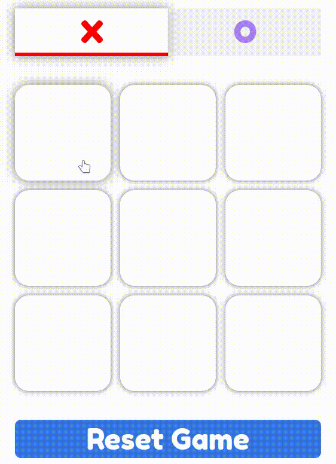

# Tic Tac Toe


### Overview
This is a small tic-tac-toe game. The goal of this project is to learn the fundamentals to building any React app.

### Try out tic-tac-toe
Firstly, you have to clone this repo:
``` bash
git clone 'https://github.com/meldisoukyy/Tic-Tac-Toe.git'
cd Tic-Tac-Toe
```
Secondly, Install the dependencies,
``` bash
npm install
```
then, Run the project.
``` bash
npm run
```
Finally, you can view Tic Tac Toe game in the browser, by visiting [http://localhost:3000](http://localhost:3000`).

### Aditional Resources
* [React Tutorial](https://beta.reactjs.org/learn/tutorial-tic-tac-toe).